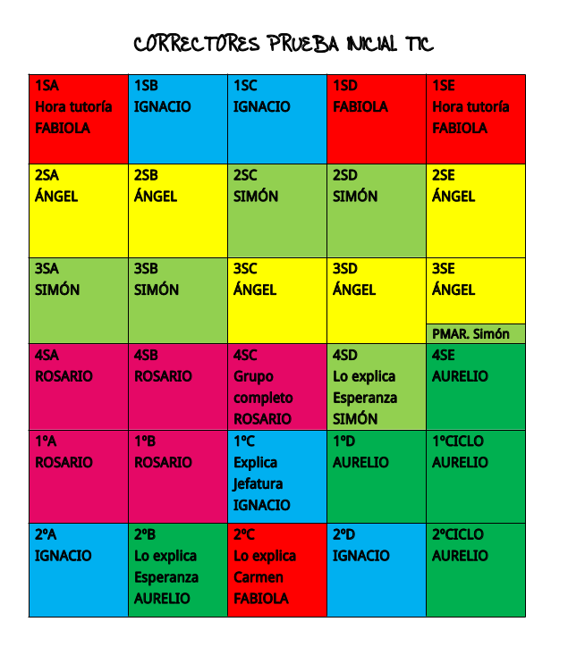

```{r setup, include=FALSE}
knitr::opts_chunk$set(echo = TRUE)
library(knitr)
```

```{r iniciales, echo=FALSE, message=FALSE}
library(printr)

datos = read.csv2("sondeoEmail.csv",header=TRUE,sep=",")
datos = datos[c(-31),] # elimino la fila del total

names(datos)=c("Unidad","N","Envíos","Móvil","Otros","Adjunto","Negrita","Cursiva","Colores","Emoticono")

# porcentaje de alumnado que envía el correo
datos$porEnviados=round(100*datos$Envíos/datos$N,1)

# Por niveles (ESO,BAC)
datos$Nivel=substr(datos$Unidad,3,5)
datos$Curso=substr(datos$Unidad,1,5)
datos$Clase=substr(datos$Unidad,7,7)

# Datos por niveles y por cursos
niveles=aggregate(cbind(N,Envíos,Móvil,Otros,Adjunto,Negrita,Cursiva,Emoticono)
                  ~Nivel,data=datos,FUN=sum,na.rm=TRUE)
cursos = aggregate(cbind(N,Envíos,Móvil,Otros,Adjunto,Negrita,Cursiva,Emoticono)
                   ~Curso,data=datos,FUN=sum,na.rm=TRUE)

# porcentaje de alumnado que envía el correo
niveles$porEnviados=round(100*niveles$Envíos/niveles$N,1)
cursos$porEnviados=round(100*cursos$Envíos/cursos$N,1)
```

\vspace{1pt}
<!-- \par\noindent\rule{\textwidth}{0.4pt} -->
\begin{center}
\par\noindent\rule{20em}{0.4pt}
\end{center}
<!-- forma de introducir una línea horizontal que ocupe todo el ancho -->
\vspace{1pt}

En este documento se recogen los resultados de la evaluación inicial de la capacidad
del alumnado del **IES Seritium** de enviar un correo electrónico a algunos de sus 
profesores/as, a través del correo electrónico creado a tal efecto bajo el dominio **@seritium.es**

# Objetivos

1. Observar el grado de competencia digital del alumnado, en cuanto a su autonomía a la hora de comunicarse con sus profesores/as en circunstancias no presenciales.

2. Detectar posibles carencias en el alumnado respecto a dicha competencia en cuanto a la habilidad de comunicación.

3. Servir de punto de partida para elaborar un plan de alfabetización digital que tenga en cuenta **\textcolor{magenta}{LINEA DE ACTUACIÓN DEL ÁMBITO PROCESOS DE ENSEÑANZA APRENDIZAJE (LINEA 2)}** del **Plan de Actuación Digital**

# Metodología

1. **Reparto de tareas:** reunión de jefatura de estudios con los miembros del eq. coordinación TDE para plantear la estrategia de comunicar la actividad evaluativa al alumnado y recoger los datos. Se decide que el mismo equipo de coordinación será el encargado de proponer la actividad y corregirla, usando una plantilla-rúbrica usando una hoja de cálculo colaborativa. El coordinador elaborará el documento de conclusiones finales.

<!--
```{r, echo=FALSE, fig.align='center', out.width="20%"}

```
<!-- Forma de introducir imágenes; center para centrar -->

{#id .class width=30% height=30%}

2. **Diseño de la tarea:** al alumnado se le comunica que debe enviar un correo electrónico a uno de los correctores, usando el campo asunto para escribir su nombre y clase, y el cuerpo del mensaje para enviar un texto usando varias herramientas de edición, como sería poner letras en negrita, en cursiva o en colores, o incluyendo emoticonos. Además, debe incluir un fichero adjunto, en el cual se le propone hacer una lista del profesorado de su eq. educativo indicando si usan para la enseñanza no presencial Moodle o G Classroom. En este sentido pueden optar por escribirlo a mano y enviar una foto de lo que han escrito, o elaborar un documento en un procesador de textos. 

3. **Plazos:** nos proponemos la semana del 9 al 15 de Noviembre. Se amplía hasta el 20 de Noviembre.

# Participación por clases

```{r datosParticipacion, echo=FALSE, eval=TRUE}
names(datos)[11]="xEnviados"
a=""
for (val in 1:30) {
 a=paste0(a,datos$Unidad[val],": ",datos$Envíos[val]," (",datos$N[val],") [",datos$xEnviados[val],"%] - ")
}
a=substring(a,1,nchar(a)-3)
# Texto en colores --> https://stackoverflow.com/questions/47298106/getting-r-printed-texts-to-have-color-esp-in-r-markdown-knits
```
La participación según clases es la que sigue: \color[rgb]{0.322,0.027,0.192}**`r a`** \color{black}.

```{r graficaParticipacion,  out.width="70%", fig.align="center", fig.height=4, echo=FALSE}
# https://r4ds.had.co.nz/graphics-for-communication.html#figure-sizing
library(RColorBrewer)
colorines <- brewer.pal(12, "Set3")
porPar= barplot(datos$xEnviados,
        ylab="Porcentajes de participación",
        main="Porcentaje de participación por clases",
        col=colorines,
        names.arg= datos$Unidad,
        ylim=c(0,100),
        cex.names = 0.6, cex.lab=0.8, cex.main=0.8,
        las=2, # orientación vertical
        font.axis=2, # bold 
        axis.lty=1, # línea horizontal
        axes=TRUE)
text(porPar,cex=0.5,paste0(round(datos$xEnviados,1),"%")
     ,y=datos$xEnviados+7,col="black",srt=90,font=2)
```

# Participación por cursos y niveles

```{r gNiveles,  fig.align="center", fig.height=2.5, echo=FALSE}
library(RColorBrewer)
colorines <- brewer.pal(8, "Set2") 
par(mfrow=c(1,2),pin=c(1.5,1.5))
# Gráfica barplot porcentaje de participación (NIVELES)
porPar= barplot(niveles$porEnviados,
                ylab="Porcentajes de participación",
                main="Porcentaje de participación por niveles",
                cex.lab=0.6,
                cex.main=0.7,
                col=colorines,
                names.arg= niveles$Nivel,
                ylim=c(0,100),
                cex.names = 0.6, 
                las=2, # orientación vertical
                font.axis=2, # bold 
                axis.lty=1, # línea horizontal
                axes=TRUE,)
text(porPar,cex=0.5,paste0(round(niveles$porEnviados,1),"%")
     ,y=niveles$porEnviados+10,col="black",srt=90,font=2)

# Gráfica barplot porcentaje de participación (CURSOS)
porPar= barplot(cursos$porEnviados,
                ylab="Porcentajes de participación",
                main="Porcentaje de participación por cursos",
                cex.lab=0.6,
                cex.main=0.7,
                col=colorines,
                names.arg= cursos$Curso,
                ylim=c(0,100),
                cex.names = 0.6, 
                las=2, # orientación vertical
                font.axis=2, # bold 
                axis.lty=1, # línea horizontal
                axes=TRUE,)
text(porPar,cex=0.5,paste0(round(cursos$porEnviados,1),"%")
     ,y=cursos$porEnviados+10,col="black",srt=90,font=2)
par(mfrow=c(1,1))
```
```{r datosParNivelesCursos, echo=FALSE, eval=TRUE}
a=""
for (val in 1:3) {
 a=paste0(a,niveles$Nivel[val],": ",niveles$Envíos[val]," (",niveles$N[val],") [",niveles$porEnviados[val],"%] - ")
}
a=substring(a,1,nchar(a)-3)
b=""
for (val in 1:8) {
 b=paste0(b,cursos$Curso[val],": ",cursos$Envíos[val]," (",cursos$N[val],") [",cursos$porEnviados[val],"%] - ")
}
b=substring(b,1,nchar(b)-3)
# Texto en colores --> https://stackoverflow.com/questions/47298106/getting-r-printed-texts-to-have-color-esp-in-r-markdown-knits
```

Siendo los datos ahora por niveles \color[rgb]{0.322,0.027,0.192}**`r a`** \color{black} y por cursos \color[rgb]{0.322,0.027,0.192}**`r b`** \color{black}. 

En total, han participado  \color[rgb]{0.322,0.027,0.192}**`r sum(datos$Envíos) `** \color{black}  de  \color[rgb]{0.322,0.027,0.192} **`r sum(datos$N) `**  **[`r round(100*sum(datos$Envíos)/sum(datos$N),1) `%]** \color{black} alumnos/as.

# Adjuntos

Contabilizando los datos de adjuntos obtenemos una gráfica del tanto por ciento de alumnado, de los que han entregado, que a su vez entregan el fichero adjunto con corrección.

```{r graficaAdjuntos,  out.width="70%", fig.align="center", echo=FALSE}
# https://r4ds.had.co.nz/graphics-for-communication.html#figure-sizing
library(RColorBrewer)
colorines <- brewer.pal(8, "Accent")
porPar= barplot(round(100*datos$Adjunto/datos$Envíos,3),
        ylab="% Entrega Adjuntos",
        main="¿Cuántos entregan adjuntos?",
        col=colorines,
        names.arg= datos$Unidad,
        ylim=c(0,100),
        cex.names = 0.6, 
        las=2, # orientación vertical
        font.axis=2, # bold 
        axis.lty=1, # línea horizontal
        axes=TRUE)
text(porPar,cex=0.5,paste0(datos$Adjunto," de ",datos$Envíos)
     ,y=round(100*datos$Adjunto/datos$Envíos,1)/2,col="black",srt=90,font=2)
```

```{r datosAdjuntos, echo=FALSE, eval=TRUE}
c=""
for (val in 1:30) {
 c=paste0(c,datos$Unidad[val],": ",datos$Adjunto[val]," (",datos$Envíos[val],") [",round(100*datos$Adjunto[val]/datos$Envíos[val],1),"%] - ")
}
c=substring(c,1,nchar(c)-3)
# Texto en colores --> https://stackoverflow.com/questions/47298106/getting-r-printed-texts-to-have-color-esp-in-r-markdown-knits
```
Datos por clase: \color[rgb]{0.322,0.027,0.192}**`r c`** \color{black}. 

Y parece también interesante ver resultados por niveles y clases:

```{r gAdjuntosNiveles,  fig.align="center", fig.height=2.5 ,echo=FALSE}
library(RColorBrewer)
colorines <- brewer.pal(8, "Accent") 
par(mfrow=c(1,2), pin=c(1.5,1.5)) #pin, tamaño de las columnas y filas
# Gráfica barplot adjuntos (NIVELES)
porPar= barplot(round(100*niveles$Adjunto/niveles$Envíos,3),
        ylab="% Entrega Adjuntos",
        main="Adjuntos por niveles",
        col=colorines,
        names.arg= niveles$Nivel,
        ylim=c(0,100),
        cex.names = 0.6, cex.main=0.8, cex.lab=0.8,
        las=2, # orientación vertical
        font.axis=2, # bold 
        axis.lty=1, # línea horizontal
        axes=TRUE)
text(porPar,cex=0.5,paste0(niveles$Adjunto," de ",niveles$Envíos)
     ,y=round(100*niveles$Adjunto/niveles$Envíos,1)/2,col="black",srt=90,font=2)

# Gráfica barplot adjuntos (CURSOS)
porPar= barplot(round(100*cursos$Adjunto/cursos$Envíos,3),
        ylab="% Entrega Adjuntos",
        main="Adjuntos por curso",
        col=colorines,
        names.arg= cursos$Curso,
        ylim=c(0,100),
        cex.names = 0.6, cex.main=0.8, cex.lab=0.8,
        las=2, # orientación vertical
        font.axis=2, # bold 
        axis.lty=1, # línea horizontal
        axes=TRUE)
text(porPar,cex=0.5,paste0(cursos$Adjunto," de ",cursos$Envíos)
     ,y=round(100*cursos$Adjunto/cursos$Envíos,1)/2,col="black",srt=90,font=2)
```
```{r AdjuntosParNivelesCursos, echo=FALSE, eval=TRUE}
a=""
for (val in 1:3) {
 a=paste0(a,niveles$Nivel[val],": ",niveles$Adjunto[val]," (",niveles$Envíos[val],") [",round(100*niveles$Adjunto[val]/niveles$Envíos[val],1),"%] - ")
}
a=substring(a,1,nchar(a)-3)
b=""
for (val in 1:8) {
 b=paste0(b,cursos$Curso[val],": ",cursos$Adjunto[val]," (",cursos$Envíos[val],") [",round(100*cursos$Adjunto[val]/cursos$Envíos[val],1),"%] - ")
}
b=substring(b,1,nchar(b)-3)

```

<!-- orden color del paquete xcolor (ver preamble.tex) --> 
<!-- se puede usar con ciertos colores, o con formato RGB de 0 a 1--> 
Siendo los datos ahora por niveles \color[rgb]{0.322,0.027,0.192}**`r a`** \color{black} y por cursos \color[rgb]{0.322,0.027,0.192}**`r b`** \color{black}. 

En total, han entregado los ficheros adjuntos  \color[rgb]{0.322,0.027,0.192}**`r sum(datos$Adjunto) `** \color{black}  de  \color[rgb]{0.322,0.027,0.192} **`r sum(datos$Envíos) `** \color{black} alumnos que han enviado el correo, lo que arroja un porcentaje de  \color[rgb]{0.322,0.027,0.192} **[`r round(100*sum(datos$Adjunto)/sum(datos$Envíos),1) `%]** \color{black} alumnos/as que saben enviar un fichero adjunto en un correo electrónico.

```{r gAdjuntosBoxplot,  fig.height=3, fig.align="center", echo=FALSE}
# https://r4ds.had.co.nz/graphics-for-communication.html#figure-sizing
library(RColorBrewer)
colorines <- brewer.pal(8, "Accent")
# dibujo
boxplot(round(100*datos$Adjunto/datos$Envíos,1), 
        main="% Adjuntos - Caja intercuartílica",
        col=colorines,
        horizontal=T,
        border=colorines[5],
        yaxt="n", #remove de y axis
        lwd=1 #ancho de los bordes de las cajas intercuartílicas
        )
# eje Y
# axis(side=2,las=2)
```
La interpretación de la caja intercuartílica indica que la mayoría de los cursos se mantienen cerca de la mediana del  \color[rgb]{0.522,0.027,0.192}**`r median(round(100*datos$Adjunto/datos$Envíos,1))`%**\color{black}, aunque con dispersiones evidentes, más a la baja que al alza. 

Suponiendo el caso peor, en el que los alumnos/as que no entregan correo tampoco sabrán enviar ficheros adjuntos, tenemos un porcentaje de \color[rgb]{0.522,0.027,0.192}**[`r 100-round(100*sum(datos$Adjunto)/sum(datos$N),1) `%]** \color{black} alumnos/as que \color[rgb]{0.522,0.027,0.192}**no saben enviar un fichero adjunto** \color{black} del total de alumnos del instituto. 

# Herramientas de edición

En el estudio hemos también comprobado si el alumnado sabe editar los textos del cuerpo del mensaje con alguna herramienta de edición, tales como la negrita, la cursiva, el texto en colores o insertar emoticonos.

Es conveniente citar que en el caso de que el correo haya sido enviado mediante un móvil, en algunas versiones del gestor de correos no es posible la edición del texto y en otros sí, con lo que los datos no indican el conocimiento o no que un alumno/a pueda tener de ello.


```{r gEdicion,  out.width="70%", fig.align="center", echo=FALSE}
# https://r4ds.had.co.nz/graphics-for-communication.html#figure-sizing
library(RColorBrewer)
colorines <- brewer.pal(8, "Accent")
# Normalización
datos$Negrita=round(100*datos$Negrita/datos$Envíos,1)
datos$Cursiva=round(100*datos$Cursiva/datos$Envíos,1)
datos$Colores=round(100*datos$Colores/datos$Envíos,1)
datos$Emoticono=round(100*datos$Emoticono/datos$Envíos,1)
# dibujo
boxplot(datos[,7:10],
        main="Porcentajes de los Enviados",
        col=colorines,
        border=colorines[5],
        yaxt="n", #remove de y axis
        lwd=1 #ancho de los bordes de las cajas intercuartílicas
        )
# eje Y
axis(side=2,las=2)
```

## Explicación de la gráfica

En la mayoría de las herramientas de edición, la caja intercuartílica tiene un rango alto. Eso significa que la mayor parte del alumnado que entrega el mensaje de correo es capaz de editarlo, con medianas también muy altas en torno al **90%**. En el caso de los colores, sin embargo, la caja intercuartílica es muy amplia, lo que indica gran disparidad de porcentajes, con una mediana del **`r median(datos$Colores,na.rm=TRUE) `%**.

<!-- Insertando un salto de página --> 

# Uso del móvil

En algún caso el alumnado realizó la actividad en clase con el móvil; en otros es imposible saberlo porque la actividad la llevó a cabo en horario no lectivo. En cualquier caso, al recogerse la circunstancia o no de uso del móvil, puede inferirse un porcentaje de alumnos que, al menos, es capaz de enviar correos con el móvil.

Así, al menos \color[rgb]{0.322,0.027,0.192}**`r sum(datos$Móvil)`** \color{black}  alumnos/as de  \color[rgb]{0.322,0.027,0.192}**`r sum(datos$N)`** \color{black}  censados en el instituto \color[rgb]{0.322,0.027,0.192}**(`r round(100*sum(datos$Móvil)/sum(datos$N),1)`%)**\color{black}, es capaz de enviar mensajes a través del correo electrónico.

# Conclusiones

Según el análisis de los datos puedo concluir:

a. La mayoría del alumnado que entrega el correo sabe editarlo y mandar adjuntos. Esto es más cierto cuanto mayor edad tiene, viéndose en el análisis de los adjuntos que el alumnado que sabe mandarlos es progresivamente mayor, exceptuando el caso anómalo del ciclo formativo.

b. La edición del cuerpo del mensaje es ampliamante conocida por todo el alumnado, salvo la disparidad del uso de los colores. 

c. Atreverse a dar una razón por la cual el alumnado no entrega un correo es temerario. En una situación como ésta múltiple factores pueden intervenir: no asistencia por enfermedad, dejadez, imposibilidad de realizar la actividad por otras circunstancias... El estudio sirve más para acotar una población de alumnos que pudiesen tener problemas que para concluir los motivos por los cuales no se hace entrega de la misma. 

# Agradecimientos

Agradecer a todo el equipo de coordinación TDE que han colaborado en esta evaluación su gran trabajo. Sin ellos/as, no hubiese sido posible. 